---
output:
 html_document:
   toc: true
   toc_float: true
   theme: "paper"
---

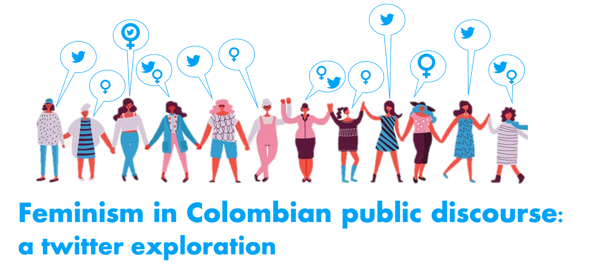  

#  Our project in a nutshell   

On the basis of tweets gathered from individual and institutional accounts, we offer here a mostly descriptive exploration of the public discourse around feminism and gender issues in the Colombian context. After some remarks about the selection of the sample, we identify the most relevant topics in our data with bi-grams and topic modelling. We then explore connections between the accounts and relative positions on some topics, with scaling and network analysis. Finally, with sentiment analysis, we explore how these tweeters feel.  

## The team 

Although all of us contributed to every aspect of the project, from the initial idea to the n-th revision of the markdown, each one took the lead on certain sections:  
<br>

Adelaida Barrera (adelaidabarrera@gmail.com)

Natalia Mejía (natimp555@gmail.com)

Mariana Saldarriaga (m.saldarriaga15@gmail.com)

Isabel de Brigard (isabeldebrigard@gmail.com)
  
#  What we set out to do

This semester we seem to be uninterruptedly glued to our screens. From zoom, to R, more and more of our days are spent in front of our phones or computers. But this trend, though exacerbated by the unusual conditions of 2020, did not start with some flying rodent far away. Digital platforms have carved up more and more of our time, and seem to direct more of our actions. As policy students, we were interested in one instance where this seems to be happening very notably: the way twitter communicates, condenses, and shapes public discourse around salient policy issues -guess it’s not procrastination if you can call it research.  

From the broad question of “how does Twitter shape public discourse in our country?”, we decided to explore the public discourse around feminism and gender issues revealed by a select group of twitter accounts of activists, political leaders, writers, and all around opinion shapers in Colombia, where the four of us come from. We wanted to flex our newly acquired data science and text-as-data analysis muscles in a **descriptive** exercise.

In what follows you will find, first, a brief section on how we chose the accounts and how we tried to tame and clean the data. Then, with the help of some bi-grams and topic modelling, we tried to identify **what these accounts actually talk about**. We then attempted to understand **how they relate to or differ from one another**, with some exercises on scaling and network analysis. Finally, through sentiment analysis, we explored **how these tweeters feel**.  
 
### A few caveats before we begin.  

 We are aware that the results we got are not always easily interpretable. For the most part, what we did was (for us) an interesting exploration of the methods we learned, which provides some insight into what this large set of tweets is about. Ultimately, this is an initial 'distant reading' of a massive amount of information that could inform further analysis and new questions on the twitter discussion on gender in the country. 

The assumptions that we need to make to take a 'text as data' approach are strong and not always easily fulfilled, and we believe some of them might be violated in the data we could acquire for this exercise. 

* First, through this exercise we learned that, unlike text data from political manifestos or speeches from a parliamentary debate, these tweeters write about a **very** wide range of **issues**, and for diverse **purposes**: expressing opinions on a matter, inviting the audience to read something, inviting people to an event, making jokes, etc. 

This led to great difficulty in subsetting the tweets that were actually expressing opinions on gender issues. We decided not to scrape tweets based on a hashtags -which could narrow the latent ‘messages’ or ‘topics’. Here, again, we understood that this would limit our analysis somewhat, but we felt we had a solid theory based reason for it. So we had that going for us, which is nice. The reason is that hashtags tend to work globally, as a shortcut to the apparently borderless internet conversation. And we felt including them might disrupt the picture of the more local discourse we were trying to paint. Given that there was not enough georeferencing informatin on the tweets we scraped, there was no easy way to go around that.  

We also decided not to create a dictionary (list of words) to filter out the tweets associated with gender issues or specific topics because for this exercise we preferred an exploratory and descriptive approach, rather than assume we knew what these feminists were talking about and introduce bias according to how we think people talk. 

* Second, tweets are **very short** texts or ‘documents’, which means there is very little information and variation within each text. This is a limitation for the methods we used to classify them into topics or find relative differences between them, purely based on the words they use –which is what treating text as data does.

We believe these limitations affected the interpretability of our results and we would suggest this is so because the words we looked at are generated in a less *stable* context, and with less *conventions* on which words to use for expressing a certain message or position than, say, political speeches at parliament.

Despite all this, we do think we can learn some interesting things about how Twitter is used by prominent feminist individuals and institutions in Colombia. 


#  The sample

## Choosing accounts and scraping the data 

Our initial intuition was that certain twitter accounts shape public discourse and that gathering those would give us a balanced and relatively complete picture of what most twitter-talk was about. This is partly the idea behind the [*Cifras y conceptos*](https://cifrasyconceptos.com/productos-panel-de-opinion/), opinion leaders panel, that traces the opinion of various individuals on a wide range of topics. These opinion leaders, they say, “differ from public opinion in general, because they are the ones who guide the climate of opinion, have the capacity for foresight and influence political issues and issues on the national agenda”, and so tracing their points of view should be telling of more than their personal standing on a given topic.  

So we dove into the twitterverse to see who came out to greet us. With a combination of research, personal experience and consultation to two prominent public figures ( [Mariángela Urbina](https://twitter.com/lasigualadas?lang=en) and [Gloria Esquivel](https://twitter.com/gsesquivel)) in the Colombian feminist sphere we came up with *69 individuals and 39 institutional accounts* that seemed key to be included if we were interested in what was being said about feminism and gender issues. We tried to create a sample of accounts that were identified by these ‘experts’ as indeed belonging to one same conversational space in Twitter (trying to get somewhat a stable discursive context) and that were ideologically diverse, so we explicitly asked to include ‘opponents’ in terms of gender discussions but also political ideology. This is, of course, not a representative sample of Colombian society and not even of the feminist movement in the country, since it was not chosen at random, and people self-select into writing on Twitter. But that is an issue with all Twitter analysis (See for example Barberá, 2015).  

So, aware of the fact that this was not a complete, balanced, objective picture of the public discourse on twitter on these issues, we decided to keep going with what we had. This was our thinking: our agonizing about how bad our selection was only clarified further what our data science professors have been telling us since Stats I: fancy analytical tools only get you so far. If you actually want to be able to say something about the world, you need to work on your theory. Really work on it. But we felt this was an exercise about the tools we had learned. The tools, not the theory. And for that -to try our hand on a limited sample- we had enough. 

We built a small data frame with the real names, usernames and a couple of covariates for the individual accounts (occupation and institutions).  We set up our API authorization and scraped their timelines using the `rtweet` package and the basic (free) Twitter API, which allows to gather the latest 3200 tweets from each account . You can find the code for it (without our Twitter keys) [here](https://github.com/adelaida-barrera/twitteranalysis/blob/main/gather_tweets_individuals.Rmd) and [here](https://github.com/adelaida-barrera/twitteranalysis/blob/main/gather_tweets_institutions.Rmd). This gave us an initial tweet count of ~231,000 for individual accounts and ~93,000 for institutions, which seemed like a decent amount of text to begin with.  But what a beautiful mess we got. 


## What did our data look like? 

In our initial exploration of the data, we looked at the average tweets per individual account and the less recent tweet by account, since we knew the less frequent Twitter users would have much older tweets, which we can see  below in the plotted frequency of tweets across time (left plot). We, thus, limited our data to tweets from the last 6 months and plotted those (right plot). This produced a much more balanced sample, with 67 individual accounts and 116.402 tweets.  

<br>
<br> 
```{r, out.width = c('50%', '50%'), fig.show = 'hold', echo=FALSE}

library(knitr)

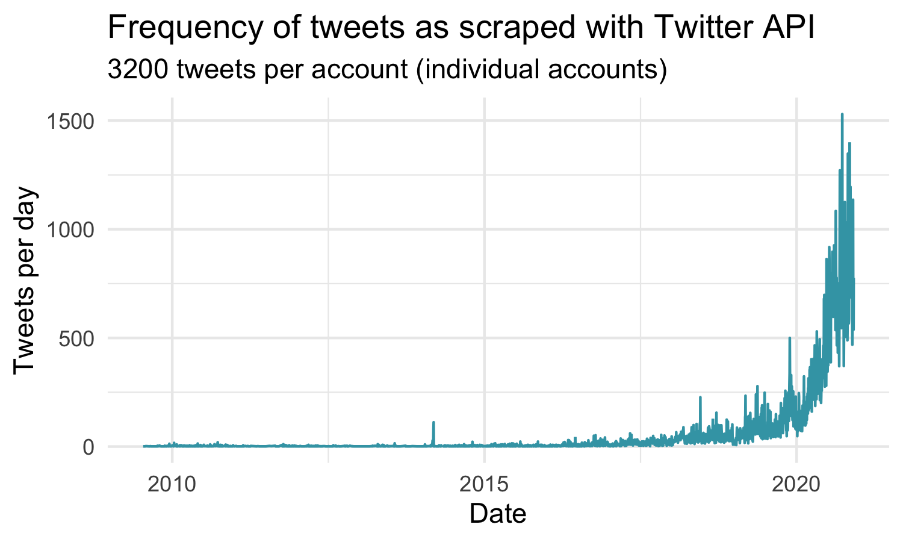
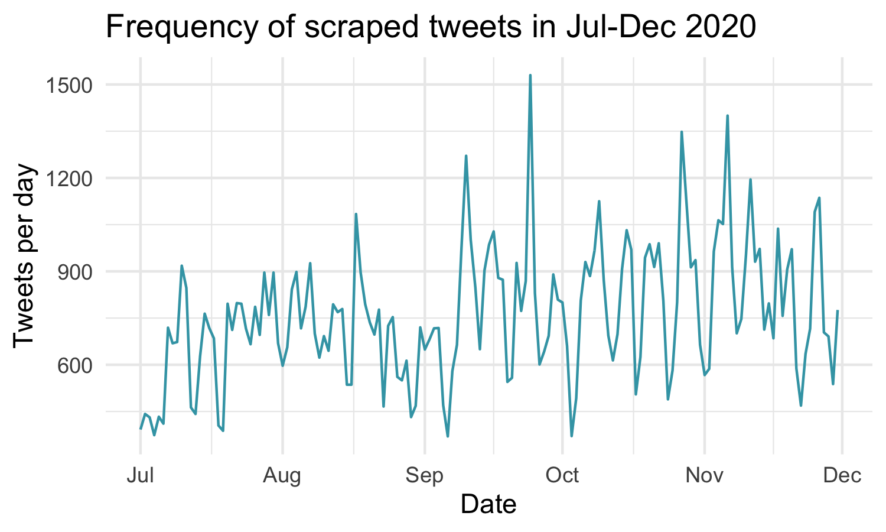

```

<br>
<br> 
After having run some topic models with a random sample of 7000 tweets from this subset, we realized congress women (which we had selected for their prominence in the feminist agenda) were creating a lot of noise, since they mainly use their accounts for political campaigns and to showcase their work in all sorts of issues. So we decided to remove them from the sample.


Finally, we restricted the institutional accounts to match the same period we had chosen for the individual ones, and ended up with 39 accounts and 25.941 tweets. Here, because the institutions we had chosen are explicitly dedicated to the topics we were interested in, there was no need to leave anyone out. Institutions are, well, more institutional... 

<br>
<br> 

```{r, out.width = c('50%', '50%'), fig.show = 'hold', echo=FALSE}

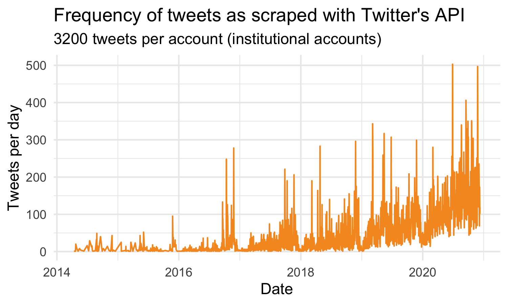
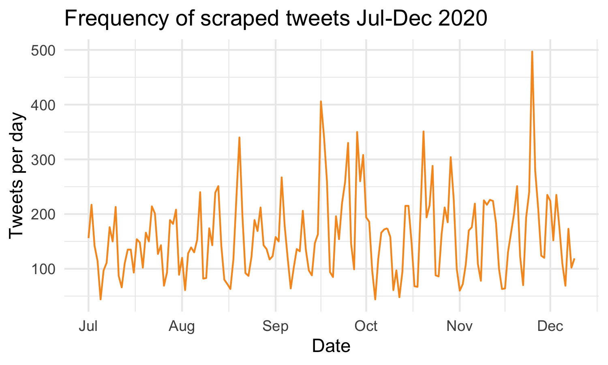

```

<br>
<br> 

## Cleaning the data 

Using the `quanteda` package, we transformed the vector of tweets we had into a ‘document feature matrix’, which is composed of *all* the terms (distinct words) contained in all tweets as separate columns, and each tweet (our ‘documents’) as a distinct row; the cells of the matrix contain the count of how many times that word is present in each tweet. As expected (Mandelbrot, 1966), there are a few very uninformative words that appear many times (in Spanish “el”, “la”, “un”), many words that appear very seldom, and the most informative words -the ones used in this particular context– are somewhere in between. Getting at those is the tricky part of analyzing text as mere data. 

We removed stop words (both those that come in the *tm* package, as some we compiled in our own list, since the available stopwords lists in Spanish are not great yet), punctuation, numbers, hashtags and symbols, including emojis –which tweeters use **a lot**. Then we removed mentions: we were after the what is what, more than the who is who of Colombian feminist tweeter. 

This process is tedious, Twitter data involves a lot of cleaning; [here](https://github.com/adelaida-barrera/twitteranalysis/blob/main/data_cleaning_feminists.Rmd) is the code for it. But we had gotten this far and were finally ready to see what all these tweets were about.  


#  What are these tweets about?

To identify some broad categories or topics that these women tweet about, we used the `stm()` function from the `stm` package to estimate a structural topic model. Behind this technique lies the assumption that the words generated in the tweets (which we can observe) were chosen by the tweeters when intending to talk about a topic (which is latent, unobserved). Stm is an unsupervised model that infers topics from the text  –the tweets are not coded into topics or categories by hand. “Topics” therefore are not defined as a clear cut subset of words, but as a distribution over the ‘bag of words’ that compose the corpus of tweets: for each topic, each word has a probability of being part of it –we can gather a matrix (“beta”) of all words present in the corpus with the corresponding proportions of them that compose each topic; this allows us to see the words that “contribute” most to each topic. Additionally, in this model each document is represented as a combination of topics and for each document we can see a matrix (“theta”) of what proportion of each document corresponds to each topic. (See [Roberts et al., 2014](https://authors.library.caltech.edu/52278/7/topicmodelsopenendedexperiments.pdf)). This technique essentially infers a lot of information solely based on the count of words observed from each document and the resercher’s specification of **how many topics** it should look for (also see Roberts  et al about how there is no “right” answer for this). 

In practical terms, we ran this STM by turning our ‘dfm’ (matrix of counts of words in each document) into an stm corpus and [ran our topic models](https://github.com/adelaida-barrera/twitteranalysis/blob/main/topic_model_fem_full.Rmd), independently for individual and institutional accounts. After trying out different specifications of how many topics we should have on random samples of the large dataset we had, we prioritized the interpretability of such topics, defined 10 as the right number, adjudicated labels to them based on our reading of the most likely words to belong to each topic. Even so, the model did not perfectly classify the documents according to our semantic interpretation: when looking into documents classified as predominantly from a certain topic, we found tweets that a human classifier would definitely put in a different basket. But all in all what we got seemed reasonable.  


## What are the most common expressions in the network?

Before modeling, we wanted to observe the data structures to look for text relations. Following certain techniques found online, like the one employed by Orduz (2018), we [performed](https://github.com/adelaida-barrera/twitteranalysis/blob/main/network_analysis_individuals.Rmd) a network analysis. This will allow us to understand graphically the tweets' text as a weighted network. 

As a first exploration, we saw the pairwise relative occurrence of words, also known as bi-grams.
We created the bi-grams and did the respective cleaning of them (remove stopwords, https, emoticons, pairs of words not relevant, etc.). Afterwards, we defined a weighted network from the bi-gram count and got our first graphs (for individual and institutional accounts):

- Each word is going to represent a node.
- Two words are going to be connected if they appear as a bi-gram.
- The weight of an edge is the number of times the bi-gram appears in the corpus.

We also added some additional information to the visualization. We set the sizes of the nodes and the edges by the degree and weight respectively. We used the *strength* function to get the weighted degree. 

Moreover, we extracted the biggest connected component of the network to understand the most frequent conversations between gender public opinion leaders -individuals and institutions- on Twitter. We computed the clusters with a big threshold (100) and also with a smaller threshold (50). The last one allowed us to get a more complex network.

Finally, as Orduz (2018), we employed the Louvain Method for community detection. The precedent is an algorithm for detecting communities in networks. It evaluates how much more densely connected the nodes within a community are, compared to how connected they would be in a random network (neo4j, December 2020). It recursively merges communities into a single node and executes the modularity on the condensed graphs. We performed the method to check precisely the density of our connected nodes (words).

### Bi-grams of individual accounts

Among the individual accounts, we observe that the pair of words connected with higher weight within the network are, among others: 
 
- sexual, violence, work, harassment
- persons, women, trans
- human, rights
- elites, political, drug trafficking
- democracy, if not, destroy  

This means that gender conversation leaders in Twitter tweet mostly about sexual violence and harassment at work, trans women, human rights, etc. This gave us clues for our models' topic results.  

<br>
<br>

```{r, fig.show = 'hold', echo=FALSE}
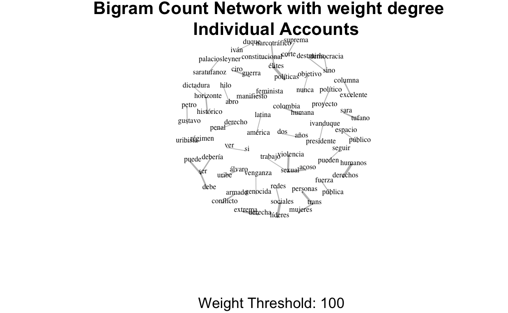
``` 


<br>
<br>

With a big threshold (100), the biggest connected compound is not a surprise. However, when we decreased the threshold, we saw a more complex network of words. It seems that most of the tweets of gender public opinion leaders are build on progressive movements who advocate for the rights of women and, particularly, trans women who have been killed. 

<br>
<br>

```{r, fig.show = 'hold', echo=FALSE}
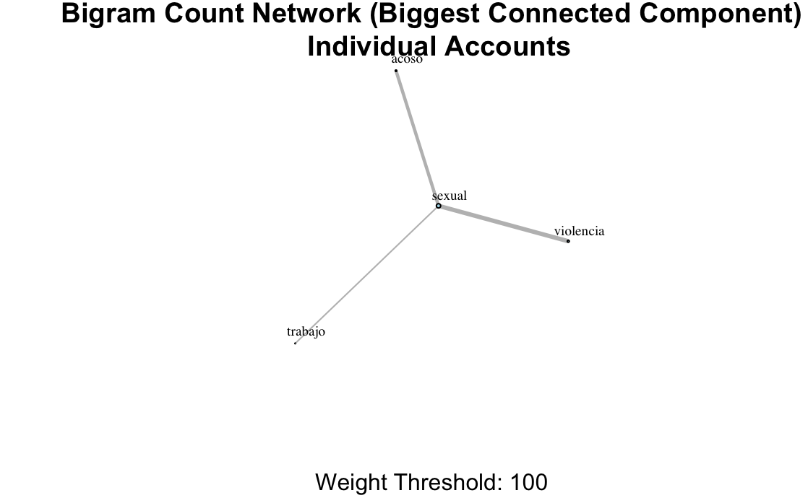   
```

```{r, fig.show = 'hold', echo=FALSE}
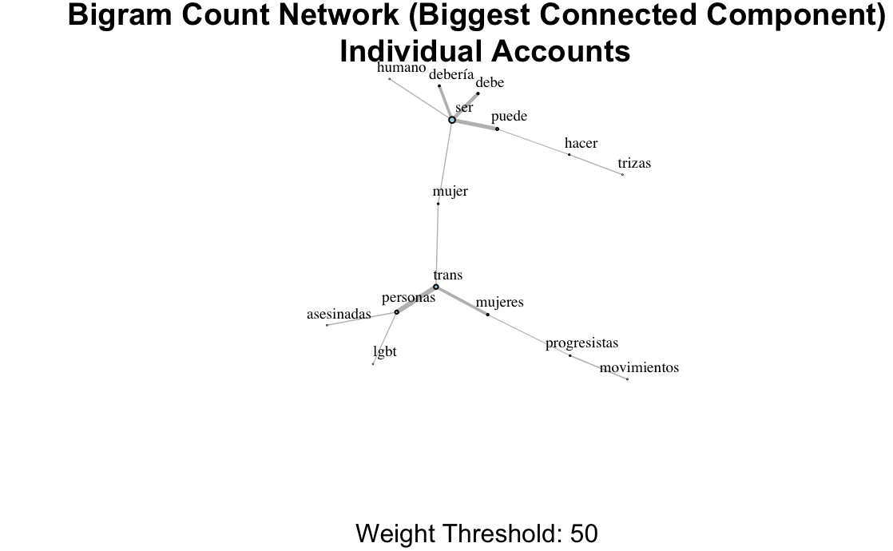
```


<br>
<br>

Finally, the community detection results for individual accounts show that four groups where identified and the modularity (measure for the “quality” of certain partition of the nodes in a network like clusterings) is 0.5 within the biggest connected compound of the word network. This result doesn't seem either good nor bad, given that in this scale results are better the closer to 1 they are. However, we believe the 0.5 modularity is a good number to show the quality of the conversation's density of connections (within words).   

### Bi-gram of institutional accounts

The following pairs of words are the most frequent and relevant within institutions in gender conversations:  

- sexual, violence, intrafamily, abuse
- persons, trans, lgbt, lgbti
- rights, humans, sexual
- women, victims, indigenous
- digital, channels
- armed, conflict  

<br>
<br>

```{r, fig.show = 'hold', echo=FALSE}
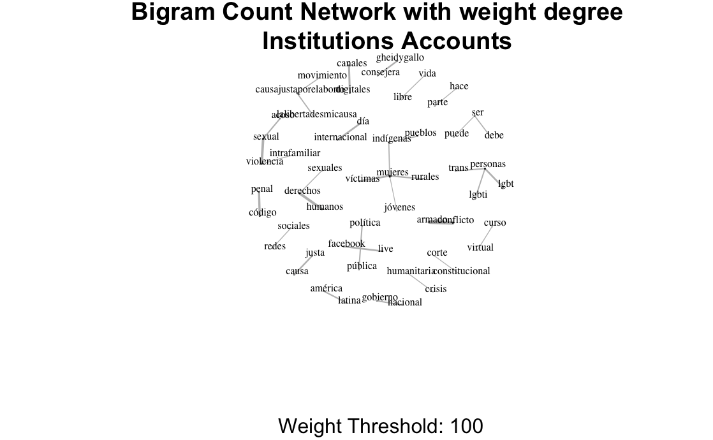
``` 

<br>
<br>
The following graphs allowed us to conclude that the conversation among institutions, who aim to achieve gender equality -in their own way- in Colombia, is mainly about women who are victims of violence. Specifically, rural, young and indigenous women. The last seems reasonable since structural inequalities affect indigenous and rural women the most. Furthermore, gender equality has been deeply discussed in peacebuilding conversations. Women are one of the groups most affected by the armed conflict in Colombia.  


<br>
<br>
```{r, out.width = c('50%', '50%'), fig.show = 'hold', echo=FALSE}

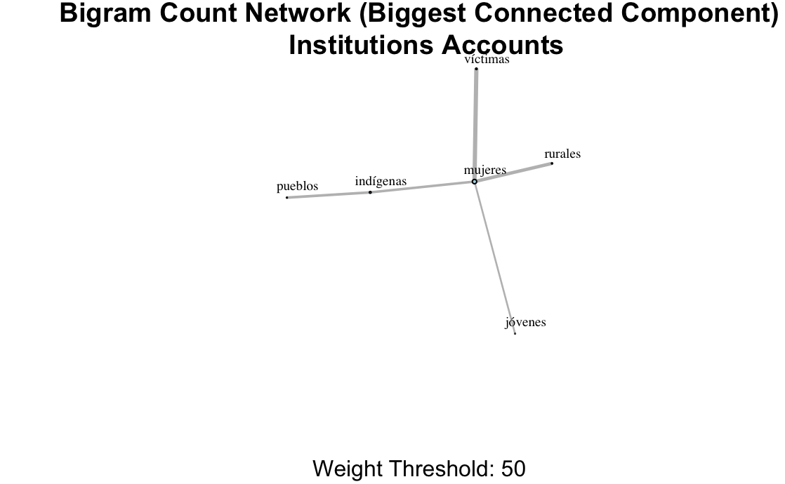
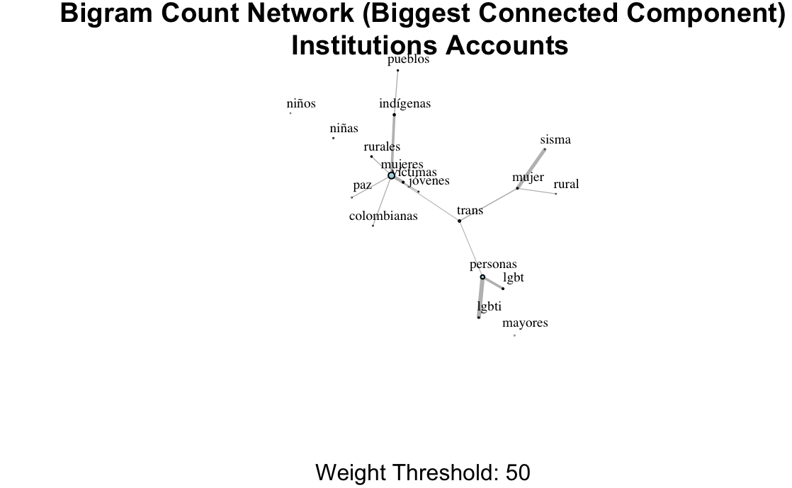

``` 

<br>
<br>

The community detection results show that 2 groups where identified and the modularity is 0.22. Institutions have a smaller modularity then individuals. It seems that the individuals' conversation is more densely connected than institutional discourse on Twitter.  

### Conclusions 
Conversations among activists, political leaders, writers, and all around opinion shapers from Colombia, including private or public institutions and NGOs in defense of women's rights, are centered in women's rights. Who would say? Within individual accounts, it seems that work harassment and sexual violence are at the center of the conversation. On the contrary, institutions are more focused on exposing and advocating for the injustices towards indigenous and rural women. 

## What topics can we identify? 

To identify some broad categories or topics that these women tweet about, we used the `stm()` function from the `stm` package to estimate a **structural topic model**. Behind this technique lies the assumption that the words generated in the tweets (which we can observe) were chosen by the tweeters when intending to talk about a topic (which is latent, unobserved). STM is an unsupervised model that infers topics from the text  –so the tweets are not coded into topics or categories by hand. “Topics” therefore are not defined as a clear cut subset of words, but as a distribution over the ‘bag of words’ that compose the corpus of tweets: each word is assigned a probability of being part of topic. So, from the model we can gather a matrix (“beta”) of all words present in the corpus with the corresponding proportions of them that compose each topic; this allows to us to see the words that “contribute” most to each topic. Additionally in this model each document is represented as a combination of topics: for each document we can see a matrix (“theta”) of what proportion of it corresponds to each topic. (See [Roberts et al., 2014](https://authors.library.caltech.edu/52278/7/topicmodelsopenendedexperiments.pdf)). This technique essentially infers a lot of information solely based on the count of words observed from each document and the resercher’s specification of **how many topics** it should look for (also see Roberts  et al about how there is no “right” answer for this). 

In practical terms, we ran this STM by turning our ‘dfm’ (matrix of counts of words in each document) into an stm corpus and [ran our topic models](https://github.com/adelaida-barrera/twitteranalysis/blob/main/topic_model_fem_full.Rmd) independently for individual and institutional accounts. After trying out different specifications of how many topics we should have on random samples of the large dataset we had, we prioritized the interpretability of such topics, and defined 10 as the right number. Based on the most likely words to be in each category we have a human semantic interpretation to them and adjudicated labels to them. Yet, the model did not perfectly classify the documents according to our semantic interpretation: when looking into documents classified as predominantly from a certain topic, we found tweets that a human classifier would definitely put in a different basket. But all in all what we got seemed reasonable.  

### Topics in institutional accounts

To take a closer look at the topics we identified, we gathered the most prevalent topic in each tweet (the highest “theta”) and could see how many documents were mainly talking about each topic.

```{r, fig.show = 'hold', echo=FALSE}
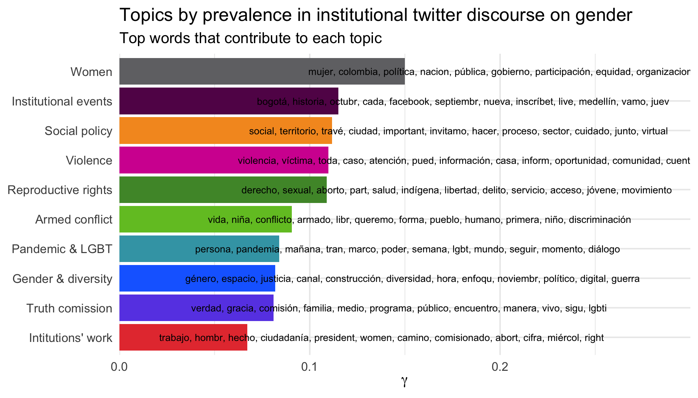
``` 
Our chosen institutions spend a lot of time tweeting about women in the public sphere; they also use Twitter to talk about their institutional events and work, which was also to be expected. And then it gets more interesting. Institutional accounts talk almost as much about social policy, as they talk about violence. And both the armed conflict and the truth commission figure prominently.  

The model also picked up the conversation about reproductive rights that was sparked by an attempt made mid November to re-criminalize the three grounds on which abortion is currently legal in Colombia. In line with the decision of the supreme court -which upheld its 2006 verdict de-criminalizing abortions under certain circumstances-, the accounts we chose talk about abortion in terms of rights and access.  

Another cluster of discourse formed around the LGBT community and the pandemic. This is probably due to the escalation of police violence against the LGBT community in their efforts to enforce curfews put in place due to the pandemic. But in true institutional spirit, this topic includes more words about dialogue, than about accountability.  

### Topics in individual accounts

```{r, fig.show = 'hold', echo=FALSE}
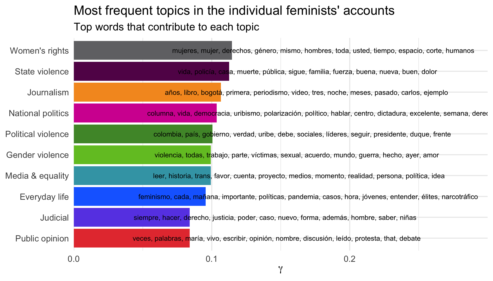
```

Individual accounts center on women’s rights, which seems fairly obvious. It is however interesting that discourse here seems focused still on achieving equality with respect to men, which might be an initial indication of how far the debate on gender is in Colombia.  

As with the institutional accounts, violence features very prominently, but here it seems to be mostly connected to the state. Individual accounts also comment often on wider topics of national politics and public opinion, which was perhaps to be expected, but raised our concerns about the classification of the documents our model was able to do.  

### Do topics differ by occupation? 

We got curious about how different occupations might affect the prevalence of these topics in each account. And since we had that information, we went ahead: 

```{r, fig.show = 'hold', echo=FALSE}
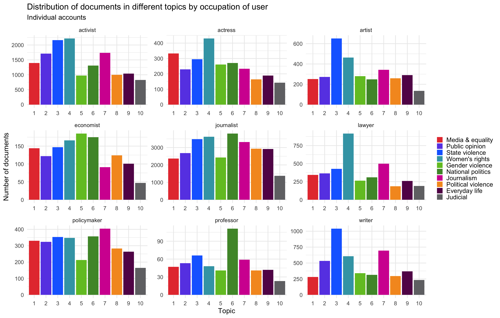
```

A couple of interesting outcomes:

- Artists, activists and writers tweet the most about state violence.  
- Policy makers seem to have an opinion about everything, but mostly talk about journalism.  
- Economist seem very concerned about gender violence. Wait, what? Told you our model wasn’t perfect.  

### What is each topic about? Word-topic probabilities


Based on the matrix of the probability of each word being generated from each topic (betas),some things caught our eye:  


```{r, fig.show = 'hold', echo=FALSE}
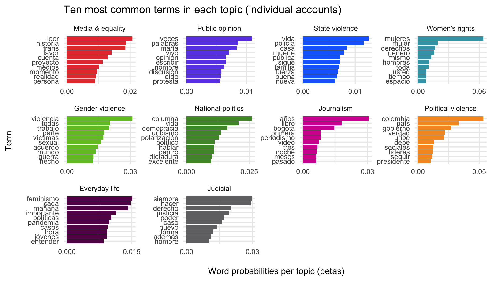
```

```{r, fig.show = 'hold', echo=FALSE}
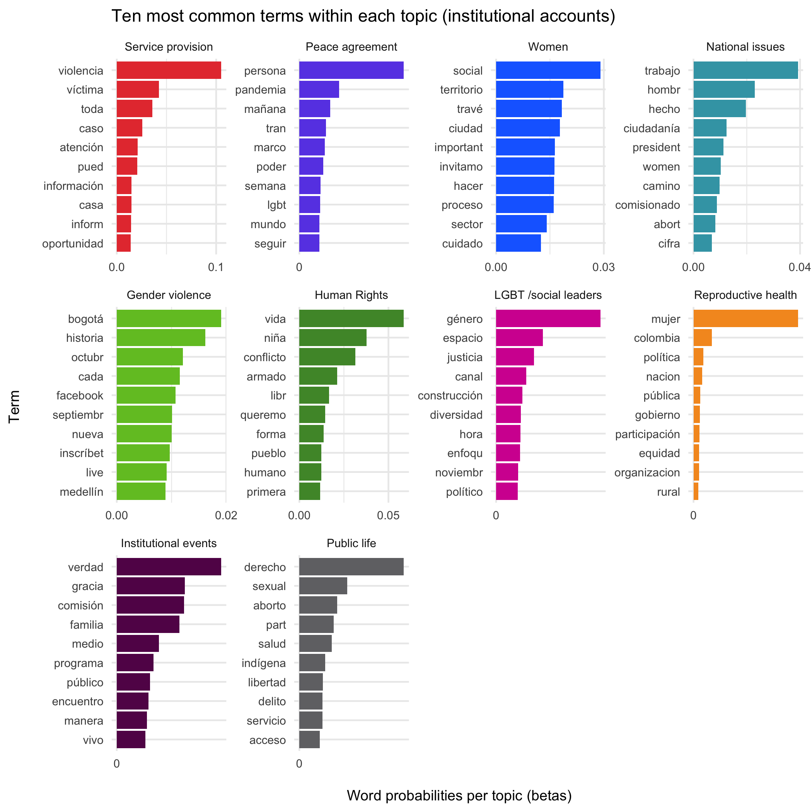
```

Some things caught our eye:  

- Although most institutional events are in Bogotá, the talk about social policy seems to be all about the territory. Centralization strikes again…  
- Abortion is still top of the list in terms of reproductive rights for institutions, but is not so prominent in individual accounts.  
- National politics is talked about often in relation to op-eds.  
- Individual accounts talk about polarization, and often include words such as ‘dictatorship’, which might be indicative of that political climate.   


## Do these topics change in time? 

Since Twitter's API allowed us to get information on the day tweets were published, we can see the proportion of documents from each topic by week from July to December of 2020. We reviewed the events that occurred during this period to get a better understanding of the trends the data presents.

### Individual accounts 
```{r, fig.show = 'hold', echo=FALSE}
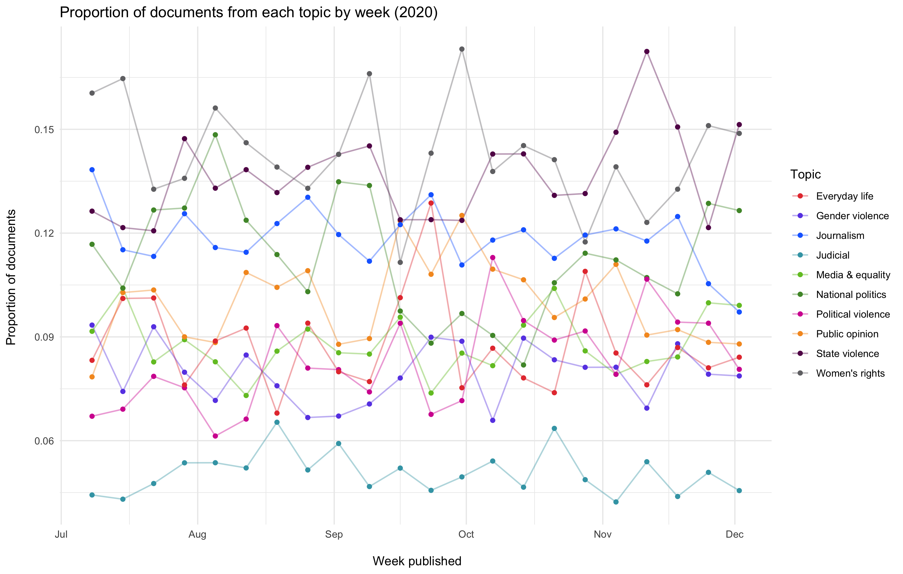
```

```{r, fig.show = 'hold', echo=FALSE}
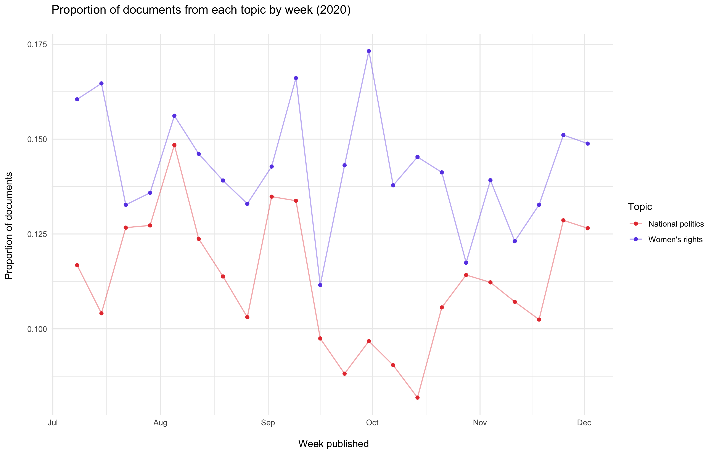
```

Some things caught our eye:

-	The highest proportion of documents talk about women´s rights and State violence.  
-	Women´s right had several peaks during this period, our intuition is this trend is due to the debates in Congress about abortion and gender parity on electoral lists from July to October, and the International Day for the Elimination of Violence against Women in November.  
-	State violence was a recurrent topic too, we believe it is related with the cases of police brutality occurred in September in Bogota and the National Strake held in November.  
-	National politics has a peak in August, this may be related to the extradition of the ex-paramilitary Salvatore Mancuso to Colombia and the possibility of his participation in the Special Peace Jurisdiction; this event created great polarization in the public opinion.  

### Institutional accounts 

```{r, fig.show = 'hold', echo=FALSE}
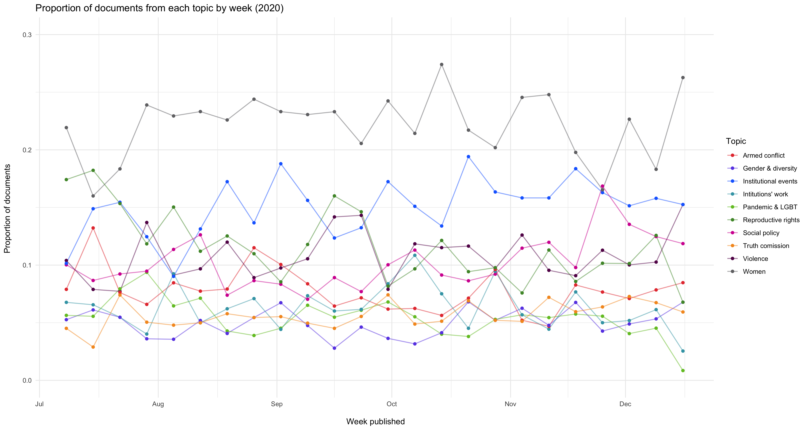
```
Some things caught our eye:  

-	The highest proportion of documents talk about women and institutional events  

-	Violence has a peak between September and October that coincides with the peak in the individual accounts regarding State violence  

#  How do they relate and differ from each other?

Now we move to positions! Similar to a topic model but with only two topics, tried to see how would these tweets be distributed if we placed them in a single shared space. Who would be closer to who in the way they talk. This technique is particularly used to place speakers in an ideological/political scale, since we are assuming here that the choice of words they do is expressing a particular 
**position** about something. So we tried to create a scale based on the tweets discussing specific topics about which we could hypothesize these womens would be expressing a position when tweeting about them. 

The scale allows us to identify how close is each account from each other depending on the vocabulary they use regarding a topic, in this case we selected political topics and reproductive health topics.   

It is important to mention that inside our selected categories (political topics and reproductive rights) the accounts include information of other topics, hindering the precision of the analysis. It was not possible to do a clean subset of the twitter accounts that only discussed one "real", clearly interpretable, topic. This is why, we believe the topic model has some limitations with Twitter data and more manual classification might be needed to improve precision.  


## How would they be distributed if put in a single space? 


We were interested in seeing how would these tweets be distributed if we placed them in a single shared space, a single scale. This technique is particularly used to place speakers in an ideological/political scale, since we are assuming here that the choice of words they do is expressing a particular **position** about something. So we tried to create a scale based on the tweets discussing specific topics about which we could hypothesize these women would be expressing a position when tweeting about them. So, following the suggestion in Baerg & Lowe (2020)  of combining topic models and scaling to limit the policy issues at stake, we leveraged the models we had used before. For the individual accounts we tried to capture differences in political ideology by selecting tweets about the two political topics, while for the institutional accounts we tried to gather tweets on reproductive health (pregnancy interruption and such). We selected tweets with the highest ‘thetas’ (topic proportions) corresponding to these topics; some accounts were lost on the way and the number of document decreased. 

For the scaling analysis we did not use individual tweets as separate texts or documents, but concatenated all the tweets by a single user into one string (one text), **as if** their ‘position’ on a topic were expressed by the sum of all their tweets on it. This is assuming, ultimately, that the tweeters express their position on these issues drop by drop, tweet by tweet. We did this because, otherwise, the “space” to be created by measuring differences in word uses between the thousands of tweets in question, which we tried and was very uninformative. 

It is important to mention that inside our selected categories (political topics and reproductive rights) the accounts include information of other topics, hindering the precision of the analysis. We were not able to do a clean subset of the tweets only discussed one "real", clearly interpretable, topic. Perhaps a manual classification, a different unit of analysis or different models might be useful to improve precision.  

For that reason it is not clear that we can interpret these scales as representing an  ideological spectrum, yet the scales do represent polarity in the way these accounts speak of these modeled topics, and allow us to identify how far are these accounts from one another other depending on their choice of words. 

### Tweets on politics 

```{r, fig.show = 'hold', echo=FALSE}
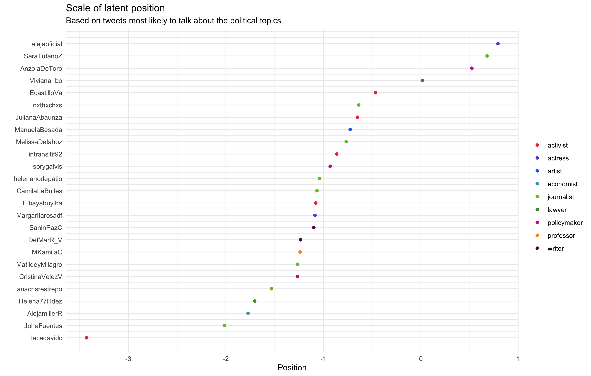
```

Analyzing the scale based on tweets discussing political topics, it is possible to observe that from the sample of 25 twitter accounts, only three of them position in the positive quadrant, one in 0 and the rest of them in the negative quadrant. These results imply that most of the twitter accounts selected, when discussing political topics, use similar vocabulary, so they are close to each other in the scale. 

Lacadavidc, an activist, distances from the group positioning beyond -3, this could be due for her polemic positions against the women trans movement. In contrast, we observe alejaoficial, who positions almost in 1, she is a famous artist who advocates against women violence. The scale shows these two women, even though they talk about women´s rights, they do it using different vocabulary.  


### Tweets on reproductive health

```{r, fig.show = 'hold', echo=FALSE}
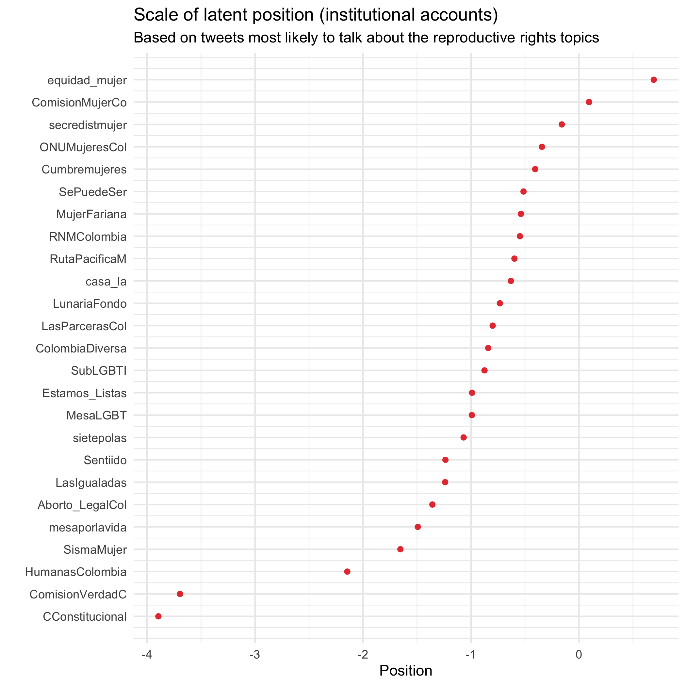
```
*What do the extremes of the scale seem to represent?*  

The institutional accounts scale discussing reproductive rights topics show us an interesting account grouping. The accounts close to 0 and the positive quadrant are institutions that advocate for women´s rights: Women_ Equity, Women Commission Colombia, Women Secretary and ONU Women, so these accounts mainly use vocabulary related to women and their reproductive rights. In the middle, between -2 and 0, the spectrum opens more, and we can find activists twitter accounts, these accounts are close to each other which means they use similar vocabulary and discuss similar topics, for instance, regarding abortion and the LGBT community. The last group is the Constitutional Court and the Truth Commission, we believe they are the extreme left because they use a different language compared to the other institutions or activists accounts, and they discuss a variety of topics regarding reproductive rights beyond women.  


#  How do they feel?

### Sentiment Analysis with Full-Strength Lexicon and Improved Dictionary

Previously, we explore how the accounts are positioned in space and how they relate to each other. Now we want to see how positive or negative is the vocabulary they use. To achieve this, we performed a sentiment analysis. There are different ways to do it, for instance, scaling models, classification models or dictionary models; we chose the last option! 

We began by looking for a dictionary to analyze our data. It was a challenge to find a good quality dictionary in Spanish. We choosed the Full-Strength Lexicon dictionary (Perez, V., et al, 2012) to perfom our sentimental analysis. 

Using quanteda, we applied this dictionary to our corpus to both the personal and institutional accounts. As the personal accounts contained too many documents, we grouped them by main occupation; we didn't have this issue with the institutional accounts which were analyzed individually.   

The results -with the Full-Strength Lexicon- don't show a big difference between the count of the positive and the negative words used in the individual's and institution's twitter conversations. 

As a second stage, we decided to perform a qualitative analysis of the dictionary. We found that most of the frequent words used by the accounts in each topic (information gathered in the topic model section) were not included in the dictionary we selected. As a fact the Spanish Full-Strength Lexicon- doesn't have a big set of words. Thus, we included the most frequent words in the dictionary. We did a qualitative assesment of the words' sentiments in gender discourse to improve the analysis. As expected, the sample of words increased and the interpretable results after running again the sentiment analysis improved.  

```{r, fig.show = 'hold', echo=FALSE}
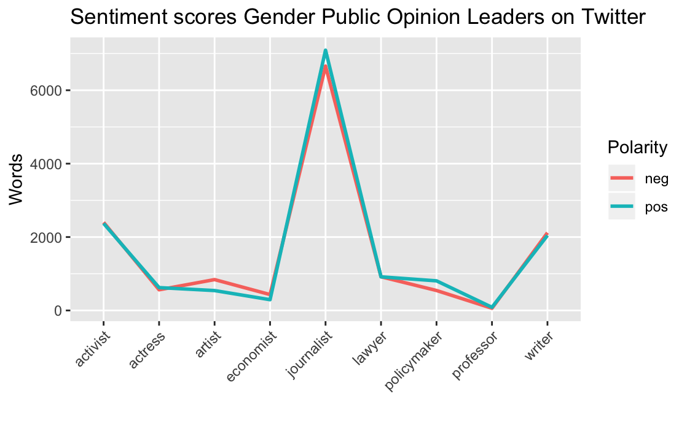
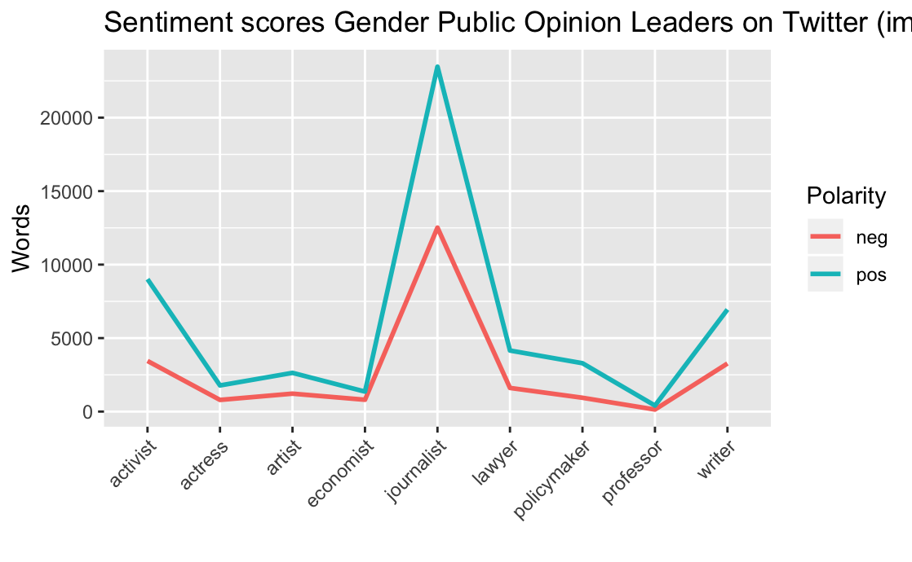
```

The sentiment score for individual accounts shows that activists, journalists, and writers are the occupations that use a higher amount of positive and negative words in their vocabulary, in contrast with other occupations. Journalists have the highest number of words, this make sense as the main task of this occupation is to communicate and inform society about different topics, so their vocabulary uses a high number of words that can be classified in a positive-negative sentiment scale.  

The positive words increased from 7.000 to around 30.000 words, and the negative from 7.000 to around 13.000. We can infer that using the improved dictionary, was mainly positive to analyse sentiments in our research interest -"gender conversation" in Twitter-Colombia. Moreover, the occupations with highest count of positive wordss continued to be activists, journalists, and writers. The highest changed between the positive and negative score is in the journalists.

```{r, fig.show = 'hold', echo=FALSE}
include_graphics("figures/24_sentiment_olddict_institutions.png")
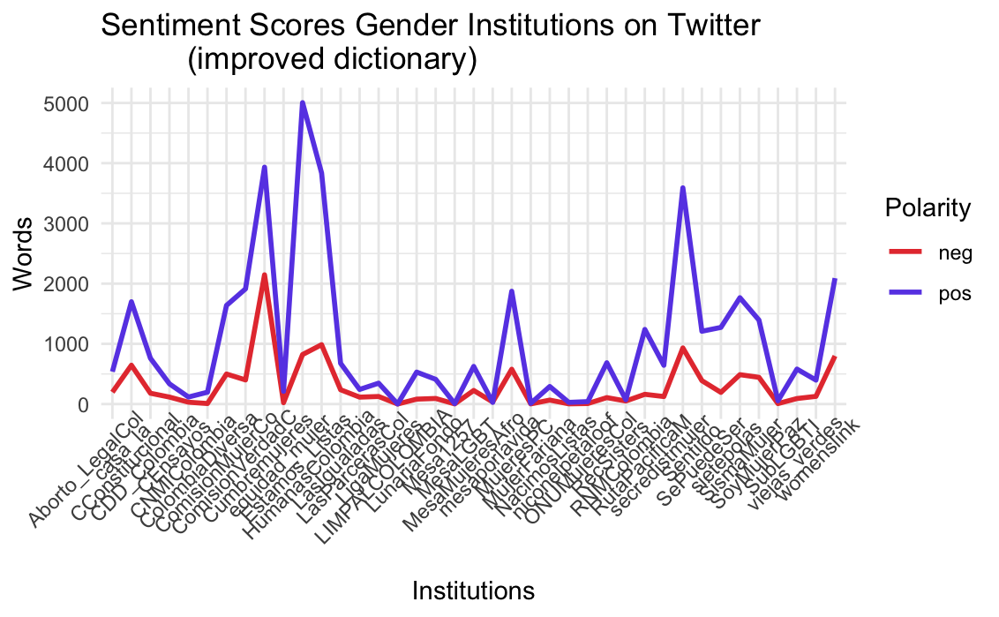
```

The institution's accounts that use the highest amount of positive and negative words are Legal Abortion Colombia, the Truth Commission, and the Women´s Secretary.   

The improved dictionary increased the sample from 1.200 to 5.000 words. Also, the variation within scores changed. We identified new peaks for positive words in Women Equity, Women Afro, Pacific Route, and Women´s Link accounts. Again, we believe the inclusion of the new words improved the quality of the sentiment analysis and shows us that the personal and institutional accounts tend to use a positive language in their tweets.  

### Sentiment analysis with NRC dictionary

We wanted to try a new dictionary to test the data again and verify the accuracy of the sentiment analysis. This time we used the NRC dictionary, which has 14.182 words and contains sentiment positive-negative and eight emotions (anger, anticipation, disgust, fear, joy, sadness, surprise, trust). 

These are the results:

```{r, fig.show = 'hold', echo=FALSE}
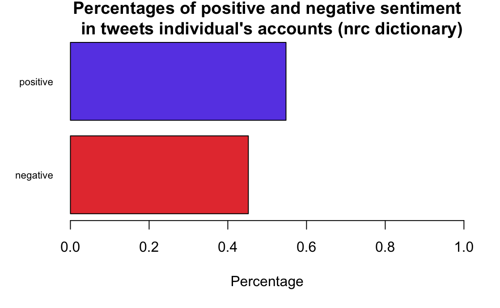
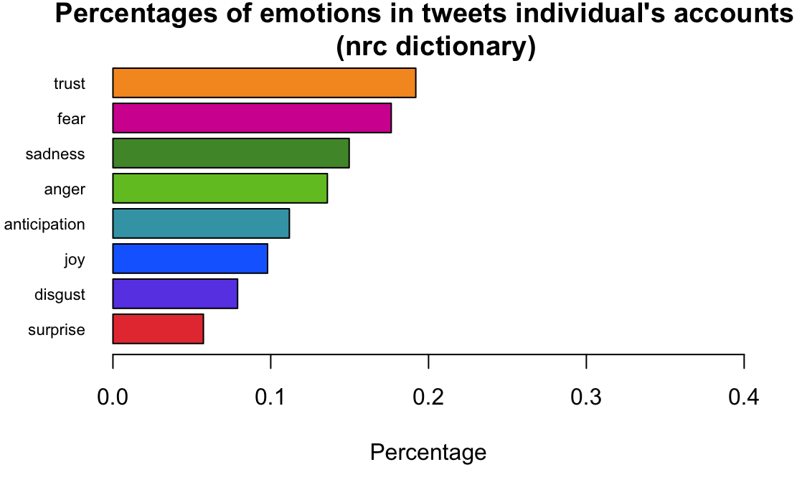
```
Coherent with the results from the improved Lexicon dictionary, individual accounts have predominantly a positive use of vocabulary. The tweets have 55% positive sentiment in contrast with 45% negative sentiment. 

Regarding the emotions, trust leads with almost 20%, followed by fear, sadness, and anger. We can evidence that the emotion with highest percentage is positive, nevertheless, negative sentiment holds a significant share. We could bring to the analysis the bigrams which showed that the most common words connected to women were sexual, violence, harassment, trans, murder; all words with a negative sentiment. 

```{r, fig.show = 'hold', echo=FALSE}
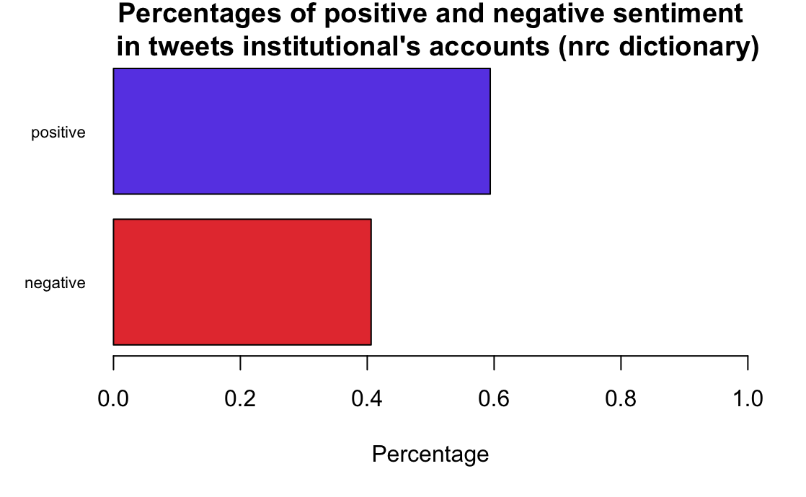
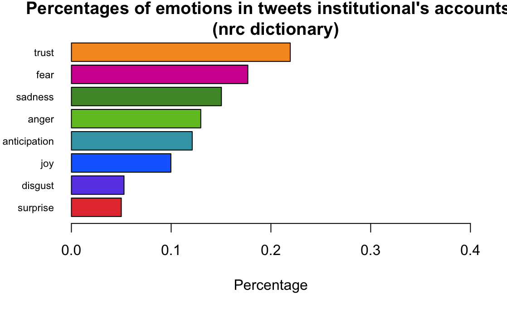
```

Institutional accounts have a higher positive sentiment, 60%, than a negative one, 40%. Institutional accounts use more positive language than individual accounts., perhaps due to the official vocabulary these accounts tend to use.

Aligned with the positive language, institutional accounts have a higher percentage of trust, more than 20%, in contrast, with the individual accounts. Additionally, as in the case of individual accounts, negative emotions follow trust, for institutional accounts the words connected to women were victims, indigenous, rural; with these words we infer the conversation centers towards injustices towards marginalized groups and the language used in these discussions tend to have a negative sentiment.

#  Final remarks

Fiuuu this was a long journey; we are almost done! To conclude our project, we want to make some final remarks:

Methodological remarks

+Gathering data from Twitter is easy but challenging to work with: 
-The text is really short
-Tweets contain a lot of noise like emoticons, @, htlm that is necessary to clean
-Twitter accounts tend to cover a lot of topics, hence, filtering the tweets into specific topics is difficult

+Institutional accounts have more uniform content, while personal accounts cover a diverse universe of topics

+For the topic model we could have included more topics to improve the statistical performance, but this would have led to less interpretable results. We prioritized the interpretable side by choosing 10 topics. 

+It could be interesting to explore new types of models for the analysis of tweets. For instance, giving a topic to each document instead of a probability of topic, as the text is so short this approach is not reasonable.

+This type of project has a high dependency on language and the development for Spanish is low compared with other languages: few stopwords to clean the data, few dictionaries.

+For the sentiment analysis the quality of the dictionary is essential, so it is important to verify the content of the dictionary or compare the results of more than one dictionary to select the best one.

+For the network and sentiment analysis we found more resources for Python than R

Content remarks:

+The results of each section of the project are consistent with our initial intuition on the subject. 

+The topics for the individual accounts were women´s rights, State violence, and journalism. And for the institutional accounts Women, institutional events, and social policy.

+In the scaling exercise we observed that the personal accounts use similar vocabulary when they discuss political topics, and the institutional accounts positioned in three different groups depending on the variety of topics discussed beyond reproductive health topics. 

+The sentiment analysis showed a positive use of vocabulary from the personal and institutional accounts. A highlight is the higher use of positive language of writers, journalists, and activists. 

#  References


Baerg, N. & Lowe, W. (2020). ‘A textual taylor rule: Estimating central bank preferences combining topic and scaling methods’. Political Science Research and Methods, 8(1), 106–122.

Mandelbrot, B. (1966). Information theory and psycholinguistics: A theory of word frequencies. In P. Lazarsfeld & N. Henry (Eds.), Readings in mathematical social science. MIT Press. 

Roberts, M. E., Stewart, B. M., Tingley, D., Lucas, C., Leder-Luis, J., Gadarian, S. K., Albertson, B. & Rand, D. G. (2014). ‘Structural topic models for open-ended survey responses’. American Journal of Political Science, 58(4), 1064–1082. 

Zipf, G. K. (1932). ‘Selected studies of the principle of relative frequency in language’. Oxford University Press. 

https://juanitorduz.github.io/text-mining-networks-and-visualization-plebiscito-tweets/  

https://neo4j.com/docs/graph-algorithms/current/algorithms/louvain/#:~:text=The%20Louvain%20method%20for%20community,for%20detecting%20communities%20in%20networks.&text=The%20Louvain%20algorithm%20is%20a,clustering%20on%20the%20condensed%20graphs 
